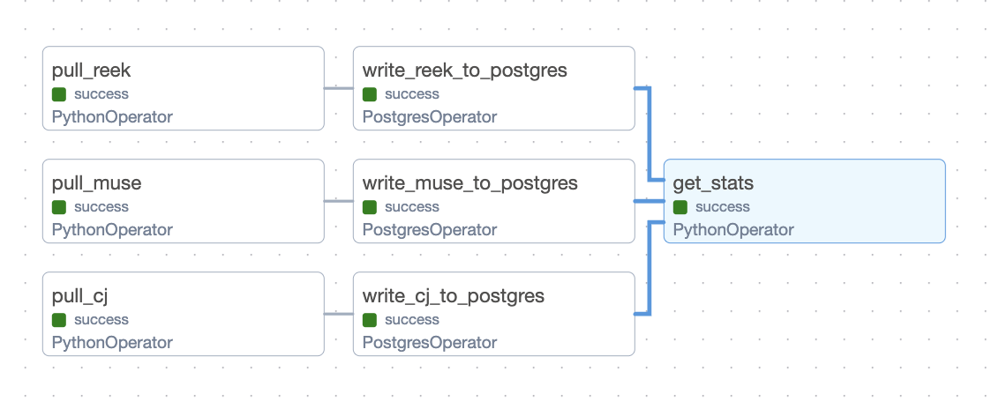
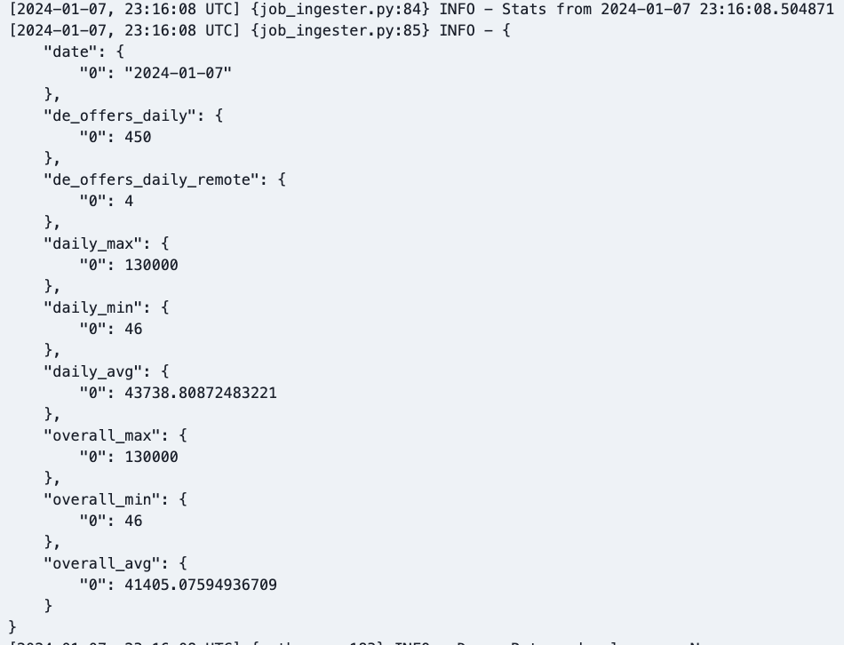

# Job Application System with Airflow

## Overview

This project utilizes Apache Airflow to orchestrate the process of pulling job data from 3 different APIs, its formatting and ingestion into the db and logging daily statistics based on daily pulled data.

## Project Structure

### Directory Structure

- `/dags`- dags executed in dockerized Airflow instance.
    - `/getters` - python scripts for each API, used in dag's tasks
- `/source_db` - python files needed to establish a schema and a table in dockerized postgres to keep the entries.
- `/stats-utils` - SQL quries returning relevant statistics, copied to the `\tmp` folder inside dockerized Airflow
- `start.sh` - script that should set you up with table establishment, airflow start-up and making needed configurations

## Airflow DAGs

### `job_ingester.py`

This main DAG orchestrates the entire data pipeline:

- **Tasks**:
  - **Pull and transform data**: 3 tasks (each for different API) ingesting the data and saving a temp .sql file that will populate pulled result in the destination DB. The .sql is overriden on each execution so no redundant sql are generated.
  - **Load Task**: Loads the processed data through an SQL script into the target database or destination.
  - **Statistics Task**: Depends on the successful execution of all prior tasks. It logs a dict of required statistics, which are retrieved through an SQL query. The dict is logged as the task's log. Example:

## Remarks
- One of the API's returns salary in DKK, so I used the conversion 1DKK = 0.13€
- I was planning to use Postgres for storing job data, so I decided to reuse the instance provided in the airflow docker-compose and just create another database within it meant for job data storage apart from Airflow logs.
- not all APIs of choice provide the data defined in the the requirements. Hence some fields are NULL. To compensate the lack of salary information I am mocking the value in range between 3000€ and 7000€.
- Although results from API's contain publish/expiry data of the job posting, those dates are not "daily" dates, the could be from beginning of 2023. That is why I am implying the "insertion_date" as the dag execution date to mimick that job postings are actually from the execution day.
- ping me on Discord if you need credentials for Reek API and local Postgres to replicate the execution on your end :) 